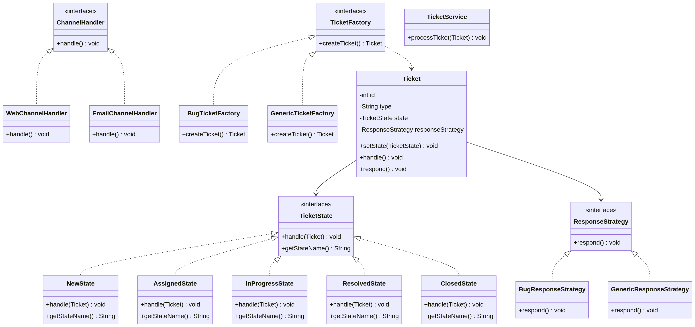

## سیستم مدیریت درخواست‌های پشتیبانی (Ticketing System)

این پروژه یک سیستم مدیریت Ticket است که با استفاده از الگوهای طراحی بازآرایی شده است.

---

##  فهرست مطالب

1. [بخش ۱: تشخیص زیرمسائل و الگوها](#بخش-۱-تشخیص-زیرمسائل-و-الگوها)
2. [بخش ۲: ترسیم Class Diagram](#بخش-۲-ترسیم-class-diagram)
3. [بخش ۳: اعمال الگو](#بخش-۳-اعمال-الگو)
4. [بخش ۴: تحلیل شی‌گرا](#بخش-۴-تحلیل-شیگرا)
5. [نحوه اجرا](#نحوه-اجرا)
6. [اعضای گروه](#اعضای-گروه)

---

## بخش ۱: تشخیص زیرمسائل و الگوها

برای تحلیل کامل این بخش، فایل `ANALYSIS.md` را مشاهده کنید.

### خلاصه زیرمسائل شناسایی شده:

#### 1. مدیریت وضعیت‌های Ticket → **State Pattern**
- **مسئله:** هر Ticket در طول عمر خود چند وضعیت را طی می‌کند
- **الگو:** State Pattern
- **دلیل:** رفتار وابسته به حالت است و باید به صورت پویا قابل تغییر باشد

#### 2. استراتژی‌های پاسخ‌دهی → **Strategy Pattern**
- **مسئله:** نوع پاسخ بسته به نوع Ticket متفاوت است
- **الگو:** Strategy Pattern
- **دلیل:** یک کار به چند روش مختلف انجام می‌شود

#### 3. ساخت Ticket → **Factory Pattern**
- **مسئله:** ساخت Ticket نیاز به تنظیمات اولیه پیچیده دارد
- **الگو:** Factory Pattern
- **دلیل:** ساخت آبجکت به صورت مرحله‌ای و با الگوریتم مشخص

#### 4. مدیریت کانال‌های ورودی → **Strategy Pattern**
- **مسئله:** هر کانال نیاز به پردازش خاص دارد
- **الگو:** Strategy Pattern + Simple Factory
- **دلیل:** هر کانال روش پردازش خاص خود را دارد

---

## بخش ۲: ترسیم Class Diagram

نمودار کلاس کامل سیستم در فایل `class_diagram.png` موجود است.



### ساختار Package ها:

- **state/** → State Pattern (6 کلاس)
- **strategy/** → Strategy Pattern (3 کلاس)
- **factory/** → Factory Pattern (4 کلاس)
- **channel/** → Channel Handler (4 کلاس)

---

## بخش ۳: اعمال الگو

### ساختار پروژه

```
src/
├── Main.java
└── edu/ticket/
    ├── Ticket.java
    ├── TicketService.java
    ├── state/
    │   ├── TicketState.java
    │   ├── NewState.java
    │   ├── AssignedState.java
    │   ├── InProgressState.java
    │   ├── ResolvedState.java
    │   └── ClosedState.java
    ├── strategy/
    │   ├── ResponseStrategy.java
    │   ├── BugResponseStrategy.java
    │   └── GenericResponseStrategy.java
    ├── factory/
    │   ├── TicketFactory.java
    │   ├── BugTicketFactory.java
    │   ├── GenericTicketFactory.java
    │   └── TicketFactoryProvider.java
    └── channel/
        ├── ChannelHandler.java
        ├── WebChannelHandler.java
        ├── EmailChannelHandler.java
        └── ChannelHandlerFactory.java
```

### مقایسه قبل و بعد:

#### State Pattern
**قبل:**
```java
if (status.equals("NEW")) { /* ... */ }
else if (status.equals("ASSIGNED")) { /* ... */ }
```

**بعد:**
```java
ticket.setState(new AssignedState("engineering"));
ticket.handle();
```

#### Strategy Pattern
**قبل:**
```java
if (type.equals("BUG")) { sendBugResponse(); }
else { sendGenericResponse(); }
```

**بعد:**
```java
ticket.respond(); // استراتژی در Factory تنظیم شده
```

#### Factory Pattern
**قبل:**
```java
Ticket t = new Ticket(1, "BUG", "WEB");
t.setResponseStrategy(new BugResponseStrategy());
```

**بعد:**
```java
TicketFactory factory = TicketFactoryProvider.getFactory("BUG");
Ticket t = factory.createTicket(1, "WEB");
```

---

## بخش ۴: تحلیل شی‌گرا

تحلیل کامل در فایل `OOP_ANALYSIS.md` موجود است.

### خلاصه نتایج:

| اصل | قبل | بعد | نتیجه |
|-----|-----|-----|-------|
| **SRP** | نقض می‌شد | رعایت می‌شود |  بهبود کامل |
| **OCP** | نقض می‌شد | رعایت می‌شود |  بهبود کامل |
| **LSP** | استفاده نمی‌شد | رعایت می‌شود |  بهبود |
| **ISP** | interface های بزرگ | interface های کوچک |  بهبود |
| **DIP** | وابستگی به concrete | وابستگی به abstraction |  بهبود کامل |

### چه جاهایی بهتر شده؟
✅ حذف کامل if-else های تو در تو  
✅ رعایت تمام اصول SOLID  
✅ Package ها منسجم و قابل استفاده مجدد  
✅ کد قابل توسعه بدون تغییر کد موجود  
✅ تست‌پذیری بالا  

### چه جاهایی بدتر شده؟
⚠️ تعداد فایل‌ها افزایش یافته (از 3 به 20 فایل)  
⚠️ پیچیدگی اولیه برای درک ساختار  

**اما** این موارد در مقابل مزایا قابل چشم‌پوشی است.

---

## نحوه اجرا

### کامپایل
```bash
javac -d out src/Main.java src/edu/ticket/*.java src/edu/ticket/*/*.java
```

### اجرا
```bash
java -cp out Main
```

### خروجی نمونه
```
=== Processing Bug Ticket from Web ===
Received from web
Ticket created
Assigned to engineering

Working on ticket
Sending bug response
Ticket resolved
Logging ticket handling : 1 -> CLOSED

=== Processing Generic Ticket from Email ===
Received from email
Ticket created
Assigned to support
Working on ticket
Sending generic response
Ticket resolved
Logging ticket handling : 2 -> CLOSED
```

---

## اعضا

1. Milad Davoodi(DSCLANDESTINE)
2. Ali Ebadian


